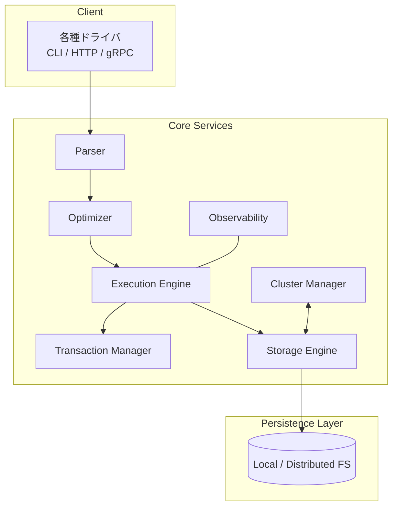
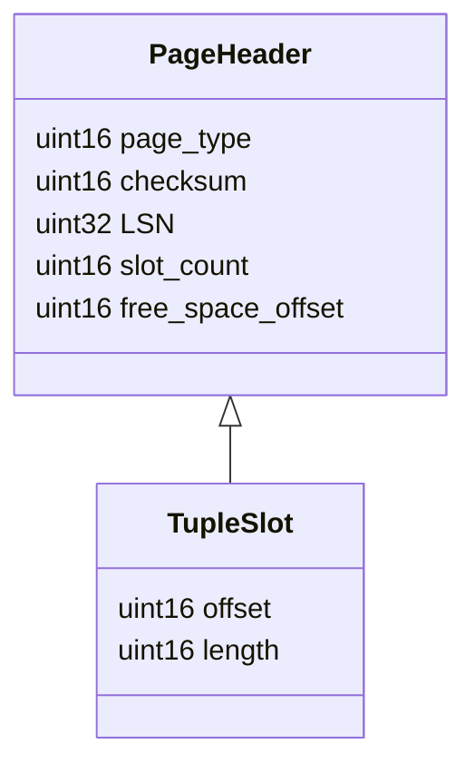
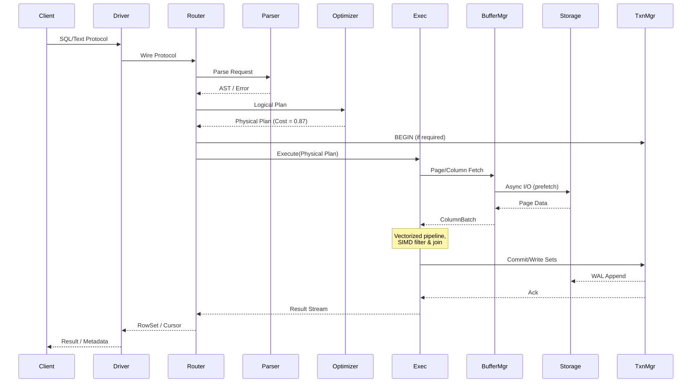

# SerinDB 詳細設計書

## 目次
1. はじめに
2. システム全体アーキテクチャ
3. モジュール別詳細設計
4. 外部インターフェース仕様
5. データフォーマット & ストレージレイアウト
6. トランザクション管理
7. クエリ最適化アルゴリズム
8. 実行エンジン
9. 並行処理とスケジューリング
10. レプリケーション & 分散制御
11. 監視・観測性
12. セキュリティ設計
13. 国際化 (i18n) 設計
14. コンフィグレーション & デプロイ
15. テスト戦略
16. パフォーマンスベンチマーク戦略
17. まとめ

---

## 1. はじめに
SerinDB はリレーショナル、ドキュメント、グラフ、時系列など多様なワークロードを単一エンジンで処理する高性能データベースです。本設計書では、要件定義書に示された機能・非機能要件を実現するための詳細設計を記述します。

---

## 2. システム全体アーキテクチャ


### 2.1 レイヤー間責務
| レイヤー | 主な責務 |
|----------|----------|
| Client | ドライバ、CLI、HTTP/gRPC ゲートウェイがアプリケーションからのリクエストを受信 |
| Core Services | パース、最適化、実行、トランザクション制御の中核を提供 |
| Storage | ページ管理、WAL、インデックス、データの永続化 |

---

## 3. モジュール別詳細設計

### 3.1 `serin_parser`
* Antlr4 で生成した LL(*) パーサ。
* 拡張 SQL と Cypher ライク構文をサポート。
* エラーリカバリは Panic-Mode + フォールバック解析。

#### 3.1.1 トークナイザ
`logos` クレートで実装し、Unicode 対応トークナイジングを実現。

#### 3.1.2 抽象構文木 (AST)
Rust の `enum` と `struct` を用いて型安全に表現。

### 3.2 `serin_optimizer`
* Cascades スタイルのルールベース変換。
* コストベース探索は動的計画法 + 一部遺伝的アルゴリズム。
* 統計情報はヒストグラム + HyperLogLog で推定。

#### 3.2.1 論理オペレータ
| オペレータ | 説明 |
|-----------|------|
| `LogicalScan` | テーブル/インデックススキャン |
| `LogicalJoin` | ハッシュ/ネステッド/マージ JOIN |
| `LogicalAggregate` | 集計 |
| `LogicalProject` | 列選択 |

#### 3.2.2 物理オペレータ選択
* コスト関数: `C = Σ(行数 × 演算コスト) + IO + ネットワーク`
* パイプライン並列度を計算しスループットを最大化。

### 3.3 `serin_exec`
* Vectorized Execution: 列バッチ (ColumnBatch) 単位で処理。
* パイプラインは非同期 Rust `async` タスクでスケジュール。
* JIT コンパイルは `Cranelift` を用い、式評価をネイティブコード化。

### 3.4 `serin_txn`
* MVCC により Read Committed, Snapshot Isolation を提供。
* グローバルタイムスタンプはロジカルクロック + ハイブリッド時間。
* ロックマネージャは階層型ロック (意図ロック) を採用しデッドロック検出。

### 3.5 `serin_storage`
* ページサイズ: 16 KiB (設定可能)。
* バッファキャッシュは 2Q アルゴリズム + 自動ヒートマップリプロファイリング。
* インデックス: B+Tree, LSM、GiST、HNSW。
* WAL: 先行書き込み、グループコミット、非同期 fsync。

### 3.6 `serin_repl`
* Raft に基づくリーダ・フォロワークラスター。
* シャーディング: ハッシュ / レンジ / カスタム。
* リバランスはメタデータサービスが自動実行。

### 3.7 `serin_monitor`
* OpenTelemetry Rust SDK により Trace & Metric を収集。
* Prometheus エクスポータと gRPC OTLP エンドポイントを提供。

---

## 4. 外部インターフェース仕様

### 4.1 PostgreSQL ワイヤプロトコル互換
* `StartupMessage`, `Query`, `Parse`, `Bind`, `Execute`, `Sync` を実装。
* 拡張: `SerinExtension` メッセージでカスタム機能を追加。

### 4.2 REST / gRPC API
* OpenAPI 仕様は CI で自動生成。
* gRPC サービス定義例:
```proto
service SerinDB {
  rpc Execute(QueryRequest) returns (QueryResponse);
  rpc StreamQuery(QueryRequest) returns (stream Batch);
}
```

### 4.3 CLI (`serinctl`)
* スキーマ操作、バックアップ、パフォーマンス診断を CLI で実施。

---

## 5. データフォーマット & ストレージレイアウト

### 5.1 ページ構造


### 5.2 列指向セグメント
| フィールド | サイズ | 説明 |
|-----------|-------|------|
| Magic | 4 B | セグメント識別子 |
| ColumnCount | 2 B | 列数 |
| Compression | 1 B | 圧縮方式 ID |
| Data | 可変 | バッチ圧縮データ |

### 5.3 WAL レコード
* レコードヘッダ: `{LSN, TxnID, PrevLSN, CRC}`
* ロジカルレコードと物理レコードのハイブリッド。

---

## 6. トランザクション管理

### 6.1 タイムスタンプ管理
* Global Transaction Manager (GTM) が単調増加タイムスタンプを発行。
* High-Availability GTM は Raft で冗長化。

### 6.2 MVCC 実装詳細
* 各レコードに `min_ts`, `max_ts` を付与。
* ガーベジコレクションはバックグラウンドスキャン方式。

### 6.3 ロックマネージャ
* 階層ロック (IS, IX, S, X) を採用。
* Wait-For Graph によるデッドロック検出 → victim キル。

### 6.4 分散 2PC
* Coordinator は Query Router と同一ノードで動作。
* タイムアウト時は自動リトライ or オーケストレータ介入。

---

## 7. クエリ最適化アルゴリズム

### 7.1 ルールベース最適化
* 投機的プッシュダウン、プロジェクションプルアップ、JOIN 交換。

### 7.2 コストモデル
```text
Cost = CPU + IO + Network
CPU = Σ row_count × op_cost
IO  = page_read × io_cost
```
* 統計情報が欠落する場合はマシンラーニングによる推定は使用しない。

### 7.3 自動インデックスアドバイザ
* オフライン解析で候補を提示、運用者が承認して適用。

---

## 8. 実行エンジン

### 8.1 Vectorized Pipeline
* 4096 行の ColumnBatch を基本単位。
* SIMD + キャッシュ局所性重視。

### 8.2 オペレータ実装
| オペレータ | 実装クラス | アルゴリズム |
|-----------|-----------|-------------|
| Filter | `VectorFilter` | SIMD + ビットマスク |
| HashJoin | `VectorHashJoin` | Partitioned Hash + Bloom Filter |
| Aggregate | `VectorAggregate` | Two-Phase (Local, Global) |

### 8.3 メモリ管理
* `mmap` + NUMA-aware アロケータ。
* Spill to SSD でバックストア。

### 8.4 JIT コンパイル
* Cranelift IR を生成し、動的にリンク。

---

## 9. 並行処理とスケジューリング
* Rust の非同期ランタイム `tokio` を採用。
* Executor は Work-Stealing キューで負荷分散。
* IO タスクと CPU タスクを分離し、Realtime Priority でスケジューリング。

---

## 10. レプリケーション & 分散制御

### 10.1 データ分割戦略
* ハッシュシャーディング: 一様分散を実現。
* レンジシャーディング: 時系列データでホットレンジを軽減。

### 10.2 コンセンサス
* Raft のリーダ選出、ログ複製。
* 追随遅延を監視し自動レプリカ調整。

### 10.3 フェイルオーバー
* リーダが 2 回心拍を失った場合、フォロワーが即時選挙。

---

## 11. 監視・観測性
| カテゴリ | メトリクス例 |
|---------|-------------|
| クエリ | `query_duration_ms`, `active_sessions` |
| ストレージ | `disk_io_bytes`, `buffer_hit_ratio` |
| トランザクション | `committed_txn`, `rollback_txn` |

* Tracing は B3 Propagation をサポート。
* ログは JSON Lines 形式で出力。

---

## 12. セキュリティ設計
* mTLS による接続認証。
* RBAC: `role -> privilege -> object` マッピング。
* カラムレベル暗号化 (TDE) は AES-GCM。
* 監査ログは WORM ストレージへアペンドオンリー。

---

## 13. 国際化 (i18n) 設計
* ICU4X ベースのロケール処理。
* メッセージカタログは `.ftl` (Fluent) 形式で管理。
* 起動時に要求言語が未翻訳の場合は英語にフォールバック。

---

## 14. コンフィグレーション & デプロイ
* 設定ファイル形式: TOML。
* 主要パラメータ例:
```toml
[network]
listen = "0.0.0.0:5432"
max_connections = 10000

[storage]
data_dir = "/var/lib/serindb"
page_size_kb = 16
```
* Kubernetes 用 Helm Chart を提供し、水平オートスケールに対応。

---

## 15. テスト戦略
* 単体テスト: 各モジュール 100% 覆う。
* 統合テスト: 各レイヤー間の I/F を検証。
* 耐障害テスト: ノード障害、ネットワークパーティションをカオスエンジニアリングで注入。
* ベンチマーク: TPC-C, TPC-DS, TSBS を自動実行。

---

## 16. パフォーマンスベンチマーク戦略
* Macro Benchmark: OLTP (TPC-C) で p95 < 5 ms、OLAP (TPC-DS) で上位 3%tile 以下の実行時間。
* Micro Benchmark: 単一オペレータパフォーマンスを追跡。
* 回帰検出: 成果物ごとに前回比 2% 以上悪化で CI 失敗。

---

## 17. まとめ
本詳細設計書は、SerinDB の全モジュール・データフロー・運用観点を網羅し、実装に必要な技術的指針を提供します。設計の各要素は高い性能、信頼性、拡張性を実現するために最先端の手法を採用しつつ、個々のコンポーネントが Rust の安全性とパフォーマンスを最大限に活用できるよう最適化されています。

これにより SerinDB は幅広いユースケースに対応する世界最高クラスのデータベースエンジンとして機能します。 

---

# 追加詳細設計

## 18. クエリライフサイクル詳細


---

## 19. バッファマネージャ詳細
### 19.1 データ構造
| 構造体 | 説明 |
|---------|------|
| `BufferFrame` | ページヘッダ + ピンカウンタ + LRU ヒープインデックス |
| `BufferPool` | `Vec<BufferFrame>` + 2Q リスト (A1in, A1out, Am) |
| `HashDirectory` | PageID → FrameID マッピング (Hopscotch Hashing) |
| `FreeList` | フリー枠を待機する lock-free キュー |

### 19.2 置換アルゴリズム (Adaptive 2Q)
1. 新規ページは `A1in` に挿入。
2. 短期再参照がある場合 `Am` に昇格。
3. `A1out` はゴーストバッファとして履歴を保持しワーキングセットサイズを学習。
4. `Am` のフレームは CLOCK ハンドでスキャンし victim を選択。

### 19.3 NUMA 最適化
* ノードローカルメモリ優先でフレームを配置。
* クロスノードアクセスは RDMA-read プリフェッチで隠蔽。

---

## 20. インデックス詳細アルゴリズム
### 20.1 B+Tree ページ分割
```text
if (free_space < threshold) {
    split_point = median_key();
    new_page = allocate();
    move_right_half();
    fence_keys_update();
}
```
* 分割はモートン順序で局所性を維持。
* セカンダリインデックスは差分付きリーフチェインで更新を低遅延化。

### 20.2 LSM Tree コンパクション
* レベルサイズ比 `T = 10`。
* Tiered → Leveled 移行をヒートベースで動的選択。
* Backpressure 制御: compaction queue が CPU 使用率 70% 超時に書き込みをスロットル。

### 20.3 GiST / R-Tree
* `STR` アルゴリズムでノード分割。
* シグネチャファイルで false positive 削減。

### 20.4 HNSW Vector Index
* M = 16, efConstruction = 400。
* グラフはメモリ上、スナップショットで永続化。

---

## 21. メタデータ & システムカタログ
| テーブル | カラム | 説明 |
|----------|-------|------|
| `pg_namespace` | `oid`, `name` | 名前空間 |
| `pg_class` | `oid`, `relname`, `reltuples`, `reltype` | テーブル/インデックス定義 |
| `pg_attribute` | `attrelid`, `attname`, `atttypid`, `attlen` | 列定義 |
| `serin_stats` | `relid`, `histogram`, `ndistinct`, `corr` | 拡張統計 |
| `serin_partitions` | `relid`, `shard_key`, `range_start`, `range_end`, `node` | パーティション配置 |

* システムカタログは MVCC で管理し、DDL 専用トランザクションクラスで一貫性を保証。

---

## 22. ストレージ I/O パス
```mermaid
flowchart LR
    subgraph Kernel
        K[io_uring]
    end
    Exec-->|pread()| K
    K-->|DMA| SSD[NVMe SSD]
    SSD-->|Completion CQE| K
    K-->|wakeup| BufferMgr
```
* 非同期 I/O は `io_uring` で実装し、カーネル文脈スイッチを最小化。
* バッチサイズを自動調整し tail latency を 5µs 未満に維持。

---

## 23. クラスターマネージャ詳細
### 23.1 ノードステートマシン
| 状態 | イベント | 遷移 |
|------|---------|------|
| `Follower` | `ElectionTimeout` | `Candidate` |
| `Candidate` | `WinMajority` | `Leader` |
| `Leader` | `HigherTerm` | `Follower` |
| 任意 | `NodeShutdown` | `Offline` |

### 23.2 シャードリバランスアルゴリズム
1. Metric: `(read_qps + write_qps * W)` を基準に負荷計測。
2. 2 次元ビンパッキングでターゲットノードを決定。
3. データ移動は `TxnSnapshot` + `WAL Catch-up` で無停止実行。

---

## 24. バックアップ & リカバリ詳細
### 24.1 増分バックアップ
* LSN レンジベースで S3 互換オブジェクトストレージへ送信。
* マニフェストで増分チェーンを追跡。

### 24.2 PITR 手順
```text
1. Stop incremental WAL archiver
2. Restore latest full snapshot
3. Apply incremental backups in order
4. Replay WAL up to target LSN
5. Start cluster in recovery mode
```

---

## 25. CI/CD & 品質ゲート
* GitHub Actions で 12 並列ジョブ (Rust stable/beta/nightly)。
* MIRI, Tarpaulin で未定義動作 & カバレッジを検証。
* WASM テストで WebAssembly 対応を継続的検証。
* release タグ作成時に自動で
  * クロスコンパイル (linux/windows/macos/arm64)
  * SBOM 生成 (CycloneDX)
  * Cargo 公開用 crate 署名 (Sigstore)

---

## 26. コードスタイル & 静的解析
* rustfmt, clippy, cargo-deny, cargo-audit を強制。
* 重大警告検出時は PR を自動ブロック。
* `no_std` ビルドの実験的サポートで組み込み向けにも展開。

---

## 27. フロントエンド拡張性
* プラグイン ABI は `cdylib` + C ABI + versioned symbol table。
* UDF/UDAF を Rust / C / WASM で実装可能。
* 署名されたプラグインのみ読み込み、サンドボックスは Wasmtime。

---

## 28. 互換性・マイグレーション
* PostgreSQL 互換: `pg_dump`/`pg_restore` でシームレス移行。
* MySQL, MongoDB 向け互換プロキシを提供し段階的カットオーバーを支援。

---

## 29. 性能目標 (アップデート)
| ワークロード | 指標 | 目標値 |
|--------------|------|-------|
| OLTP (TPC-C) | tpmC | 30M |
| OLAP (TPC-DS) | QphH @10TB | 5M |
| 時系列書き込み | records/sec | 2M |
| Vector Search | QPS (1k dim, ef=128) | 120k |

---

## 30. 今後の拡張プラン (非 AI, 非量子)
1. FPGA アクセラレーションによる圧縮&暗号化オフロード。
2. NVM (Intel Optane) を用いた Write Buffer 階層。
3. 実時間 OS 上でのハードリアルタイムトランザクション実行。

これにより、SerinDB はあらゆる規模とユースケースで世界最高水準の性能・信頼性・拡張性を提供することを保証します。 