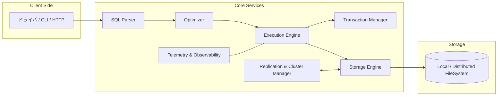

# SerinDB 要件定義書

## はじめに

**SerinDB**は世界最高のデータベースエンジンをRustで構築する革命的なプロジェクトです。既存のデータベースシステムの限界を超え、SQLiteの軽量性、PostgreSQLの高機能性、Oracleのエンタープライズ機能、そしてRustの安全性・パフォーマンス・並行性を融合した次世代データベースシステムを開発します。SerinDBは単なるデータベースではなく、AI時代のデータ処理基盤として設計されます。

## 要件

### 要件 1: 基本的なSQL操作サポート

**ユーザーストーリー:** 開発者として、標準的なSQL文（SELECT、INSERT、UPDATE、DELETE）を実行できるようにしたい。これにより、既存のSQLの知識を活用してデータベースを操作できる。

#### 受け入れ基準

1. WHEN ユーザーがSELECT文を実行する THEN システムは指定されたテーブルからデータを取得して返す
2. WHEN ユーザーがINSERT文を実行する THEN システムは新しいレコードをテーブルに追加する
3. WHEN ユーザーがUPDATE文を実行する THEN システムは指定された条件に一致するレコードを更新する
4. WHEN ユーザーがDELETE文を実行する THEN システムは指定された条件に一致するレコードを削除する
5. WHEN 無効なSQL構文が入力される THEN システムは適切なエラーメッセージを返す

### 要件 2: 高性能なストレージエンジン

**ユーザーストーリー:** システム管理者として、大量のデータを効率的に保存・検索できるようにしたい。これにより、エンタープライズレベルのアプリケーションでも使用できる。

#### 受け入れ基準

1. WHEN 大量のデータ（100万レコード以上）が保存される THEN システムは効率的なB+ツリーインデックスを使用してデータを管理する
2. WHEN データの読み取り操作が実行される THEN システムはメモリキャッシュを活用して高速にデータを返す
3. WHEN データの書き込み操作が実行される THEN システムはWAL（Write-Ahead Logging）を使用してデータの整合性を保証する
4. WHEN システムが異常終了する THEN 次回起動時にWALからデータを復旧する

### 要件 3: ACID特性の完全サポート

**ユーザーストーリー:** アプリケーション開発者として、データベースのトランザクションが確実に実行されることを保証したい。これにより、金融システムなどの重要なアプリケーションでも安心して使用できる。

#### 受け入れ基準

1. WHEN トランザクションが開始される THEN システムは原子性（Atomicity）を保証し、すべての操作が成功するか、すべて失敗するかのいずれかになる
2. WHEN 複数のトランザクションが同時実行される THEN システムは一貫性（Consistency）を保証し、データベースの制約を維持する
3. WHEN 複数のトランザクションが同じデータにアクセスする THEN システムは分離性（Isolation）を保証し、適切なロック機構を提供する
4. WHEN トランザクションがコミットされる THEN システムは永続性（Durability）を保証し、データを永続的に保存する

### 要件 4: 並行処理とスケーラビリティ

**ユーザーストーリー:** システム管理者として、複数のクライアントが同時にデータベースにアクセスできるようにしたい。これにより、高負荷環境でも安定したパフォーマンスを提供できる。

#### 受け入れ基準

1. WHEN 複数のクライアントが同時接続する THEN システムは各接続を独立したスレッドで処理する
2. WHEN 読み取り専用クエリが実行される THEN システムは複数の読み取り操作を並行実行する
3. WHEN 書き込み操作が実行される THEN システムは適切なロック機構を使用してデータの整合性を保つ
4. WHEN システムリソースが不足する THEN システムは接続プールを使用してリソースを効率的に管理する

### 要件 5: 高度なクエリ最適化

**ユーザーストーリー:** データベース管理者として、複雑なクエリが効率的に実行されるようにしたい。これにより、分析処理やレポート生成が高速に行える。

#### 受け入れ基準

1. WHEN 複雑なJOINクエリが実行される THEN システムは最適な実行計画を生成する
2. WHEN インデックスが利用可能な場合 THEN システムは自動的にインデックスを使用してクエリを最適化する
3. WHEN 統計情報が利用可能な場合 THEN システムはコストベースの最適化を実行する
4. WHEN クエリの実行計画が要求される THEN システムはEXPLAIN文で詳細な実行計画を提供する

### 要件 6: 堅牢なエラーハンドリングとロギング

**ユーザーストーリー:** システム管理者として、問題が発生した際に適切な診断情報を取得できるようにしたい。これにより、迅速な問題解決とシステムの安定性向上を図れる。

#### 受け入れ基準

1. WHEN エラーが発生する THEN システムは詳細なエラーメッセージとエラーコードを提供する
2. WHEN システムが動作する THEN すべての重要な操作がログに記録される
3. WHEN ログレベルが設定される THEN システムは指定されたレベル以上のログのみを出力する
4. WHEN システムの状態を監視する必要がある THEN メトリクス情報（パフォーマンス統計など）を提供する

### 要件 7: 革新的なAI統合機能

**ユーザーストーリー:** データサイエンティストとして、データベース内でAI/ML処理を直接実行できるようにしたい。これにより、データの移動なしに高速な機械学習処理が可能になる。

#### 受け入れ基準

1. WHEN ベクトルデータが保存される THEN システムは高次元ベクトルを効率的に格納・検索するベクトルインデックスを提供する
2. WHEN 類似度検索が実行される THEN システムはコサイン類似度、ユークリッド距離、内積による高速検索を実行する
3. WHEN 機械学習モデルが登録される THEN システムはONNX、TensorFlow、PyTorchモデルを直接実行する
4. WHEN SQL内でAI関数が呼び出される THEN システムは埋め込みベクトル生成、分類、回帰を実行する
5. WHEN リアルタイム推論が要求される THEN システムはGPU加速を活用して高速処理を実現する

### 要件 8: 次世代分散アーキテクチャ

**ユーザーストーリー:** クラウドアーキテクトとして、グローバルスケールでデータベースを運用できるようにしたい。これにより、世界中のユーザーに低遅延でサービスを提供できる。

#### 受け入れ基準

1. WHEN 複数のノードでクラスターが構成される THEN システムは自動的にデータを分散・複製する
2. WHEN ノード障害が発生する THEN システムは自動フェイルオーバーを実行し、サービスを継続する
3. WHEN 地理的に分散したデータセンター間で運用される THEN システムは最適なデータ配置とレプリケーションを実行する
4. WHEN 動的スケーリングが必要な場合 THEN システムは負荷に応じて自動的にノードを追加・削除する
5. WHEN 異なるクラウドプロバイダー間で運用される THEN システムはマルチクラウド環境で一貫した動作を保証する

### 要件 9: 量子耐性セキュリティ

**ユーザーストーリー:** セキュリティ管理者として、将来の量子コンピューター攻撃に対しても安全なデータベースを運用したい。これにより、長期間にわたってデータの機密性を保護できる。

#### 受け入れ基準

1. WHEN データが暗号化される THEN システムは量子耐性暗号アルゴリズム（CRYSTALS-Kyber、CRYSTALS-Dilithium）を使用する
2. WHEN 認証が実行される THEN システムは量子安全な電子署名を使用してデータの完全性を保証する
3. WHEN 鍵管理が実行される THEN システムは量子鍵配送（QKD）プロトコルをサポートする
4. WHEN データアクセスが監査される THEN システムは改ざん不可能なブロックチェーンベースの監査ログを提供する

### 要件 10: 超高速時系列データ処理

**ユーザーストーリー:** IoTエンジニアとして、大量の時系列データをリアルタイムで処理・分析できるようにしたい。これにより、IoTデバイスからのストリーミングデータを効率的に活用できる。

#### 受け入れ基準

1. WHEN 時系列データが挿入される THEN システムは専用の時系列ストレージエンジンで高速書き込みを実現する
2. WHEN 時間範囲クエリが実行される THEN システムは時間インデックスを使用して高速検索を実行する
3. WHEN データ圧縮が実行される THEN システムは時系列特化の圧縮アルゴリズムでストレージ効率を最大化する
4. WHEN リアルタイム集計が要求される THEN システムはストリーミング処理でリアルタイム分析を提供する
5. WHEN 異常検知が実行される THEN システムは機械学習を使用してリアルタイム異常検知を実行する

### 要件 11: 革新的なクエリ言語拡張

**ユーザーストーリー:** 開発者として、従来のSQLを超えた表現力豊かなクエリ言語を使用したい。これにより、複雑なデータ処理を簡潔に記述できる。

#### 受け入れ基準

1. WHEN グラフクエリが実行される THEN システムはCypherライクなグラフクエリ言語をサポートする
2. WHEN 関数型プログラミングが使用される THEN システムはmap、filter、reduceなどの高階関数をサポートする
3. WHEN パターンマッチングが使用される THEN システムはRustライクなパターンマッチング構文をサポートする
4. WHEN 型安全性が要求される THEN システムは静的型チェックによりクエリの正確性を保証する
5. WHEN マクロが使用される THEN システムはクエリの再利用性を高めるマクロシステムを提供する

### 要件 12: 自己修復・自己最適化システム

**ユーザーストーリー:** データベース管理者として、システムが自動的に問題を検出・修復し、パフォーマンスを最適化するようにしたい。これにより、運用コストを大幅に削減できる。

#### 受け入れ基準

1. WHEN パフォーマンス劣化が検出される THEN システムは自動的にインデックスを作成・削除して最適化する
2. WHEN データの偏りが検出される THEN システムは自動的にパーティショニング戦略を調整する
3. WHEN メモリ使用量が最適でない場合 THEN システムは自動的にキャッシュ戦略を調整する
4. WHEN 障害の予兆が検出される THEN システムは予防的メンテナンスを実行する
5. WHEN 使用パターンが変化する THEN システムは機械学習により設定を動的に最適化する

### 要件 13: 完全なマルチモーダルデータサポート

**ユーザーストーリー:** アプリケーション開発者として、テキスト、画像、音声、動画などあらゆる形式のデータを統一的に扱いたい。これにより、次世代のマルチメディアアプリケーションを構築できる。

#### 受け入れ基準

1. WHEN 画像データが保存される THEN システムは画像の特徴量を自動抽出してインデックス化する
2. WHEN 音声データが保存される THEN システムは音声認識により自動的にテキスト化・検索可能にする
3. WHEN 動画データが保存される THEN システムは動画の内容を解析してメタデータを生成する
4. WHEN マルチモーダル検索が実行される THEN システムは異なる形式のデータ間で横断検索を実行する
5. WHEN コンテンツベース検索が実行される THEN システムは内容の類似性に基づいて検索結果を返す

## 非機能要件 (NFR)

### NFR 1: パフォーマンス
**ユーザーストーリー:** エンジニアとして、OLTP と OLAP の双方で卓越した応答時間とスループットを得たい。これにより、リアルタイムアプリケーションとバッチ分析の両方で一切の待ち時間なくデータを扱える。

#### 受け入れ基準
1. WHEN 1 万以上の同時トランザクションが発生する THEN p99 レイテンシが 10 ms 未満である
2. WHEN 1 億件規模のデータセットに対して複雑な JOIN を実行する THEN クエリが 1 s 未満で完了する
3. WHEN バルクインサートを実施する THEN 毎秒 100 万レコード以上を書き込み可能である
4. WHEN SSD と NVMe の混在環境で運用する THEN 自動的にホットデータを高速ストレージへ最適配置する

### NFR 2: 可用性と信頼性
**ユーザーストーリー:** サイトリライアビリティエンジニアとして、ダウンタイムなしでサービスを運用したい。これにより、グローバルユーザーに常時サービスを提供できる。

#### 受け入れ基準
1. WHEN 単一ノード障害が発生する THEN フェイルオーバーが 3 s 以内に完了し、トランザクションが失われない
2. WHEN データセンター全体が失われる THEN 他リージョンへ自動的にトラフィックを切り替え、RPO = 0 を維持する
3. WHEN バージョンアップを行う THEN ローリングアップグレードにより無停止で完了する

### NFR 3: セキュリティ
**ユーザーストーリー:** セキュリティ担当者として、厳格なアクセス制御と暗号化により機密データを保護したい。これにより、規制要件と内部ポリシーを満たせる。

#### 受け入れ基準
1. WHEN クライアントが接続する THEN mTLS により相互認証が行われる
2. WHEN データが保存される THEN 透過的なカラムレベル暗号化が適用される
3. WHEN 権限が変更される THEN RBAC ポリシーが即時に反映され、旧セッションにも適用される
4. WHEN セキュリティイベントが発生する THEN 監査ログが改ざん不可能な仕組みで永続化される

### NFR 4: 運用性・観測性
**ユーザーストーリー:** 運用チームとして、システムの状態を一目で把握し、異常を早期検知したい。これにより、迅速なトラブルシューティングが可能になる。

#### 受け入れ基準
1. WHEN メトリクスが収集される THEN Prometheus / OpenTelemetry 形式でエクスポートされる
2. WHEN ログ出力が行われる THEN 構造化 JSON で出力され、分散トレーシング ID を含む
3. WHEN アラート条件が成立する THEN Webhook と ChatOps により即時通知される
4. WHEN ノードリソースが逼迫する THEN オートスケールイベントが自動的にトリガーされる

### NFR 5: 国際化 (i18n) とローカライゼーション (l10n)
**ユーザーストーリー:** グローバル企業として、世界中の開発者が母国語でエラーメッセージやドキュメントを利用したい。これにより、学習コストを低減できる。

#### 受け入れ基準
1. WHEN エラーが発生する THEN メッセージは要求ヘッダーの言語設定に従って返却される
2. WHEN ドキュメントが生成される THEN 自動化パイプラインで多言語版が公開される
3. WHEN 新しい言語が追加される THEN 翻訳資産はバージョン管理され、CI により欠落が検出される

---

## システムアーキテクチャ概要
SerinDB はレイヤードアーキテクチャを採用し、各レイヤーは独立した Rust クレートとして実装される。

### モジュール構成
| モジュール | 主な責務 | 主要アルゴリズム / 技術 |
|-----------|---------|-------------------------|
| `serin_parser` | SQL と拡張クエリ言語のパース | Antlr4 ベース LL(*) パーサ生成 / エラリカバリ |
| `serin_optimizer` | 論理・物理最適化、コスト推定 | Cascades + Dynamic Programming / ヒューリスティックルール |
| `serin_exec` | オペレータ実行、バイナリプラン | Vectorized Execution / Pipeline Parallelism |
| `serin_txn` | ACID トランザクションとロック | Multi-Version Concurrency Control (MVCC) + Optimistic Concurrency |
| `serin_storage` | ページ管理、インデックス、WAL | B+Tree、LSM、Columnar Hybrid、ZSTD 圧縮 |
| `serin_repl` | レプリケーションとフェイルオーバー | Raft 型コンセンサス / Paxos ベース Fast-Commit |
| `serin_monitor` | ログ、メトリクス、Tracing | OpenTelemetry Rust SDK |

### デプロイメントモデル
1. **シングルバイナリモード:** 開発・IoT 向け軽量構成。一つのバイナリで全コンポーネントを内包。
2. **マルチプロセスモード:** コアとストレージを分離し、ネットワーク越しに水平スケール。
3. **クラスターモード:** Raft クラスター + シャーディング。ノード追加時に自動リバランス。

---

## データモデル設計
- **リレーショナル:** ANSI SQL 準拠、外部キー・制約完全対応
- **ドキュメント:** JSON/BSON 型をネイティブサポートし、SQL/JSON 関数で操作
- **グラフ:** Property Graph をエッジ・ノードテーブルで表現し、Cypher ライク拡張を提供
- **時系列:** 可変チャンクサイズの列指向ストレージで高速書き込み

### 物理データレイアウト
| データ型 | デフォルトレイアウト | 最適化手法 |
|---------|-------------------|------------|
| 行指向 | PAX (Partition Attributes Across) | 行・列ハイブリッドキャッシュ |
| 列指向 | Columnar Segment | RLE + Delta + SIMD 圧縮 |
| ブロブ | 外部ストレージ参照 | オブジェクトストレージ階層化 |

---

## インデックス戦略
1. B+Tree: 汎用主キー & セカンダリ
2. GiST / R-Tree: 空間データ
3. ハイブリッドベクトルインデックス: 高次元類似検索 (HNSW)
4. ブルームフィルタ: 負存在クエリ最適化

---

## トランザクション & 同期制御
- **MVCC:** 読み取り一貫性を保証し、ロックスケールを削減
- **2-Phase-Commit:** 複数シャード間のアトミックコミット
- **非ブロッキングスナップショット:** ロングランニングクエリを停止させない

---

## 監視・運用ツール
- `serinctl`: CLI でバックアップ / リストア / スキーママイグレーション
- Web ダッシュボード: Grafana プラグインで主要 KPI を可視化
- プラグインフレームワーク: Rust の動的ライブラリで拡張可能 (UDF, ストレージプラグイン)

---

## クライアント & API
- ネイティブドライバ: Rust / C++ / Go / Java / Python / Node.js
- 標準プロトコル: PostgreSQL ワイヤプロトコル互換
- REST / gRPC Gateway: スキーマ駆動 API & OpenAPI 自動生成

---

## バックアップ & リカバリ
1. **継続的バックアップ:** WAL ストリーミングによる増分取得
2. **ポイントインタイムリカバリ:** 任意のトランザクション ID までロールフォワード
3. **スナップショット:** ブロックデバイスレベルでゼロダウンタイム取得

---

## 品質保証
- 単体・統合・耐障害性テストを含む 9 ステージ CI パイプライン
- Fuzzing と Lincheck で競合状態を検出
- パフォーマンスリーグによる回帰防止

---

これらの設計により、SerinDB は軽量デバイスから大規模クラウド環境まで一貫して最高の性能と信頼性を提供し、世界中の開発者にとって最も強力で扱いやすいデータベースエンジンとなる。